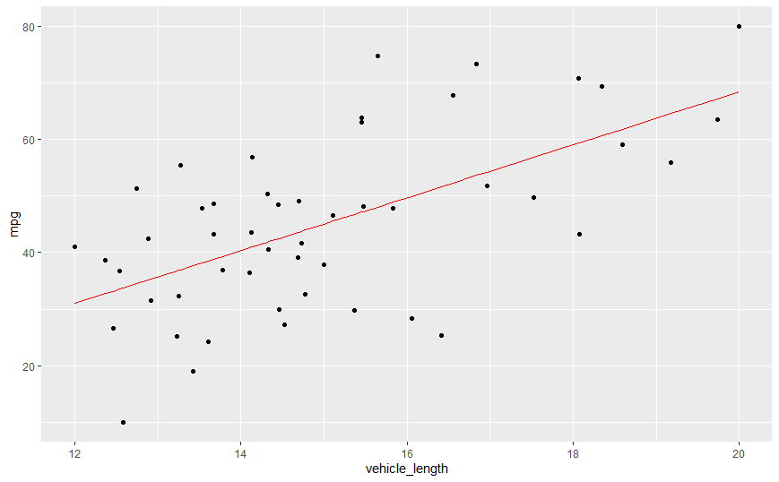
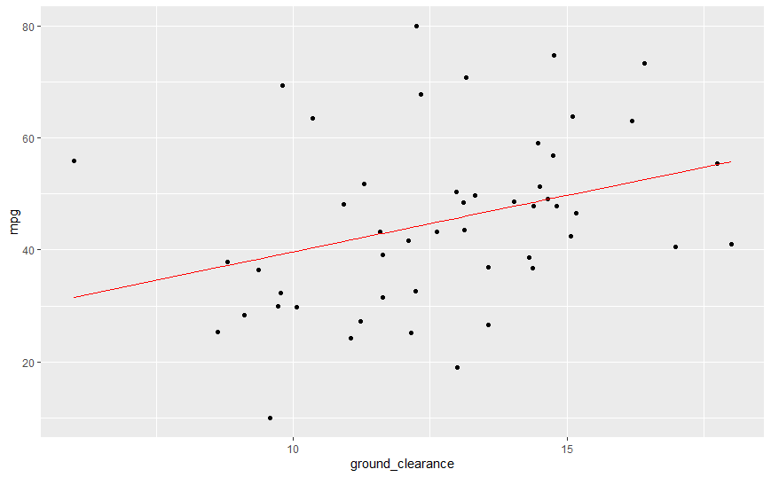
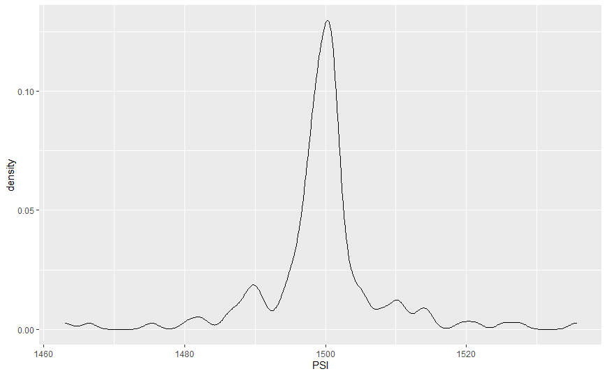
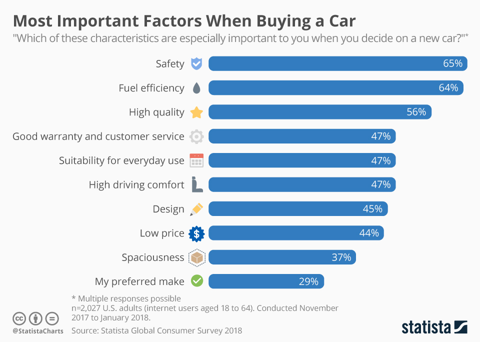

# "R" in AutosRUs

## Project Overview
AutosRUs company has realized that its decision-making process should move into the 21st century. The data analytics team is in charge of performing retrospective analysis of historical data, analytical verification, and validation of current automotive specifications, and study design of future product testing. This company recognizes that the most successful automobile launches utilize data analytics in every decision-making process. This analysis must ensure that these analyses contain a statistical backbone, a quantitative metric, and a clear interpretation of the results to keep upper management happy.  This module, the statistic test was performed by using the R programming language.  

## Resources
Data Sources: MechaCar-mpg.csv, Suspension_Coil.csv
Software:  RStudio, tidyverse, ggpubr, Visual Studio Code 1.45.1 

## Challenge Overview

The goals of this challenge:

1. Design and interpret a multiple linear regression analysis to identify variables of interest.
2. Calculate summary statistics for quantitative variables.
3. Perform a t-test in R and provide interpretation of results.
4. Design your own statistical study to compare vehicle performance of two vehicles.

## Results

### MPG Regression

#### Which variables/coefficients provided a non-random amount of variance to the mpg values in the dataset?
#### Is the slope of the linear model considered to be zero? Why or why not?
#### Does this linear model predict mpg of MechaCar prototypes effectively? Why or why not?

A multiple linear regression was performed on he MechaCar_mpg.csv dataset.  After a summary of multiple linear regression model in R was generated, Vehicle length and ground clearance provided a non-random of variance to the mpg values.  The slope of the linear model is non-zero.   The slope shows a positive correlation between the two categories and mpg. The Multiple R-squared is 0.7149 and p-value is 5.35e-11 which leads to rejecting the null hypothesis.  The model is an okay linear model predictor of mpg of MechaCar prototypes.   It is not idea.   Roughly 72% of the predictions will be correct.  That is above average.  

### Suspension Coil Summary

#### The design specifications for the MechaCar suspension coils dictate that the variance of the suspension coils must not exceed 100 pounds per inch. Does the current manufacturing data meet this design specification? Why or why not?

The suspension coil summary tells critical information about each batch. The mean and median are near 1500psi which is likely to be the design specification. The MechaCar suspension coils dictate that the variance of the suspension coils must not exceed 100 pounds per inch. The overall summary shows the MechaCar suspension coils meet design specification variance that does not exceed 100 PSI.   Once the lots were separated, Lot one and Lot two meet this design requirement. Lot three exceeds this requirement by 120 psi. The current manufacturing data does not meet the design specification.

summary(SuspenCoil_table$PSI) # mean = 1500 and median = 1500
   Min.  1st Qu.  Median   Mean   3rd Qu.    Max. 
   1463    1497    1500    1500    1501      1536 
var(SuspenCoil_table$PSI) # variance = 76.23
sd(SuspenCoil_table$PSI) # standard deviation = 8.73

Manufacturing_Lot Min_PSI  Mean_PSI  Median_PSI  Max_PSI Standard_Dev Variance

1 Lot1             1497.    1500.      1500.      1502.      1.07     1.15
2 Lot2             1490.    1500.      1499.      1506.      3.18     10.1 
3 Lot3             1463.    1499.      1498.      1536.      14.8     220.  

### Suspension Coil T-Test

#### Provide a small writeup of your interpretation and findings for the t-test results.

p-value was determined to equal 0.5117 based on the mean population.  This value is significantly larger than the assumed level of 0.05.  There is no evidence to reject the null hypothesis and the two means are significantly similar. 

One Sample t-test

data:  SuspenCoil_table$PSI
t = -0.65784, df = 149, p-value = 0.5117
alternative hypothesis: true mean is not equal to 1500
95 percent confidence interval:
 1498.122 1500.940
sample estimates:
mean of x 
 1499.531 

### Additional Study 

Competition is high when it comes to selling a car.  According to Statista Global Consumer Survey, the top three most important factors for consumers when buying are car are safety, fuel efficiency, and high quality.  There is already data collected on the fuel efficiency.  The safety and high-quality data are needed to be collected.  This is would be a great opportunity to bring the attention to all the safety features that the car has.  Newer model cars have blind spot detection.  United States Department of Transportation has safety ratings for vehicles.  Collecting information from there will be extremely helpful.  The hypothesis is does the safety features reduce risk/accident, and the null hypothesis would be if the safety features do not reduce risk/accident. 
Also let us not forget about the cost of a vehicle.  Safety and fuel efficiency are especially important.  Can customer afford the car?  Customer are not looking for vehicles that have great safety rating and fuel efficiency without spending a lot of money.  Build a relationship between cost and safety and fuel efficiency.  Does the safety features and fuel efficiency increase the cost of the car or not?

Source:  https://www.statista.com/chart/13075/most-important-factors-when-buying-a-car/
